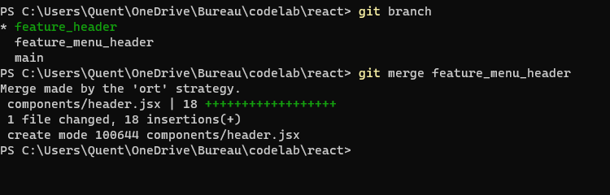

# isitech-versioning-solo

## Projet de Group

**Utilisation de diverse outils**

1. Renommage des branches en commençant par les nommée feature\_

**Utilisation des branches**

1. Création de branches pour les différentes fonctionnalités
1. utilisation du pull request pour envoyé les données des branches de fonctionnalité à la branche develop

**Création d'une section avec des article qui redirige sur des pages**

**Création d'un carousel dans le header**

## Projet Solo

## TP 1: Introduction et Bases de Git

### Création du repository :


### Clone du repository :

```sh
https://github.com/Quentin-Cheron/vscode.git
```

### Récupération et analyse des commits:


On peut voir dans la list des commits effectué qu'il y a beaucoup de commit de type **fix**

### Création d'une nouvelle branche :


### Modification du Readme :


### Commit et ajout des modification :


## TP 2: Bonnes Pratiques de Codage

### Création du repository :


### Clone du repository :

```sh
https://github.com/Quentin-Cheron/rails.git
```

### Récupération et analyse des commits:


On peut voir que les messages sont organisé avec le type du commit, les commits en anglais et compréhensible par tous

### Bonne pratique dans le code source :

Dans le code source on peut voir que : - les fichiers, dossiers sont bien organisé et rangé, - il y a des tests unitaire - plusieurs fichiers de documentations

## TP 3: Utilisation Avancée de Git

### Création du repository :


### Clone du repository :

```sh
https://github.com/Quentin-Cheron/react.git
```

### Création de 2 nouvelles branches :


### Ajout des fonctionnalité :

Branche feature_menu_header : 

Branche feature_header : 

### Création d'une fusion (merge) :



### Création d'un fichier pour le conflit :


### Premier commit pour la création du conflit :


### Second commit pour la création du conflit :


### Création du conflit :


### Affichage du conflit :


### Résolution du conflit :


## TP 4: Revue de Code et Collaboration

### Création du repository :


### Clone du repository :

```sh
https://github.com/Quentin-Cheron/tensorflow.git
```

### Analyse des pull requests :

#### Les pull request sont :

    - refusé si :
        - Si il s'agit d'un spam pr,
        - si ce n'est pas important comme une correction orthographique par exemple

Il faut signer un contrat de licence de contributeur (CLA). pour que la pull request soit examiné

### Création d'une pull request fictive

#### Création d'une nouvelle branche avec un fichier txt

#### Création d'une pull request


### Revue de code


